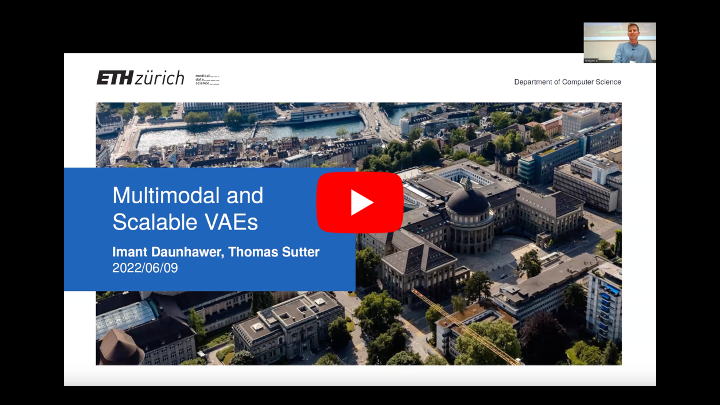
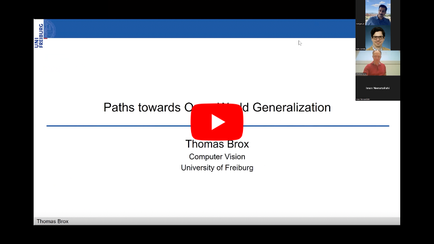
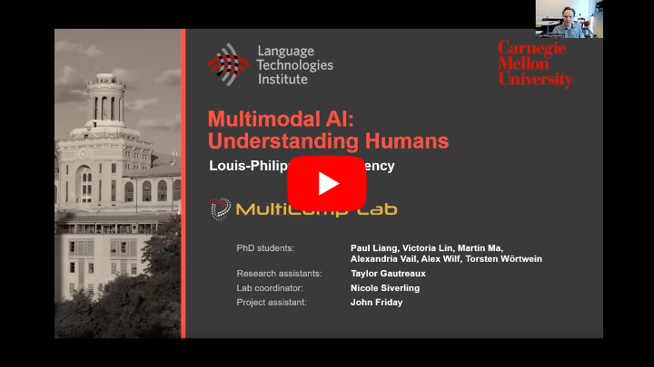
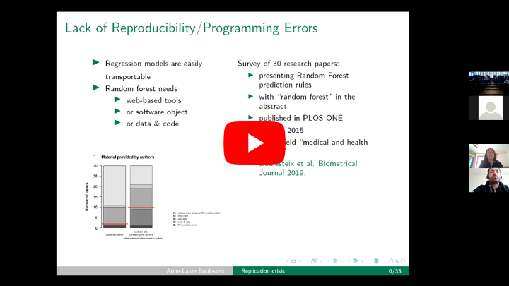
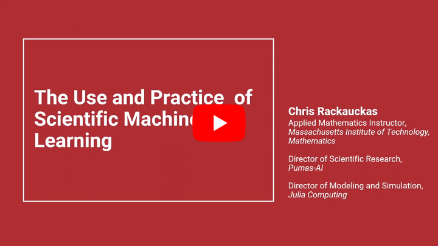
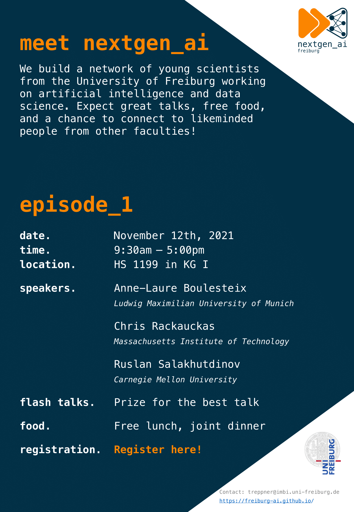

## Freiburg Young Scientist AI Network

Since an increasing number of scientists at the University of Freiburg engage in artificial intelligence research, we have decided to establish a network, particularly for Ph.D. students and PostDocs, to create a collaborative environment beyond faculty borders and foster exchange concerning various topics in AI research.

The University of Freiburg identifies data analysis and artificial intelligence as one of the [university-wide profile fields](https://uni-freiburg.de/research/research-profile/). The profile field with its speakers, [Prof. Dr. Harald Binder](https://www.uniklinik-freiburg.de/imbi/mitarbeiter.html?imbiuser=binderh&cHash=25474d715bfa2d216b434ede5e813202), [Prof. Dr. Thomas Brox](https://lmb.informatik.uni-freiburg.de/people/brox/) and [Prof. Dr. Frank Hutter](http://aad.informatik.uni-freiburg.de/people/hutter/) has set itself the goal of deepening interdisciplinary cooperation in the field of artificial intelligence at our university.

To ensure this cooperation also at the level of young scientists, we plan to bring together Ph.D. students and PostDocs from all faculties and institutions of the University of Freiburg to establish a highly interdisciplinary and diverse network of researchers to benefit from each other mutually. We are convinced it will be very valuable to know the approaches, issues, and techniques of people in other AI fields, invite exciting keynote speakers, and organize workshops based on common interests.

## Episode 3
### Date:     
June 6th and June 7th 2023
### Day 1: Talks
#### Time: 
10:00am – 5:00pm
#### Location: 
HSII, Albertstraße 23
#### Speakers:
* <b>Prof. Dr. Ribana Roscher </b> (*University of Bonn*)

* <b>Leon Sixt </b> (*Free University of Berlin*) 
 
    <b>title:</b> Explainable AI: History, Progress, and Future Directions 
 
    <b>Abstarct</b>: Explainable Artificial Intelligence (XAI) has become an essential aspect of AI research as the need for understanding and interpreting complex models grows in  parallel with their capabilities. In this talk, I will explore the history since the 70s and developments in XAI, discuss the limitations of current methods, and present my own work in evaluating explainability methods. I will begin by tracing the origins of explanations in AI and highlight the key advancements in the last years. I will then delve into the current state of the field, including established methods like Integrated Gradients, LIME, and SHAP, and their limitations.  
My research focuses on the evaluation of explainability methods, covering topics such as the examination of saliency maps and why some methods fail the sanity check, the evaluation of Deep Taylor Decomposition, and a user study on counterfactual explanations. I will also introduce the DNNR model, a simple and interpretable extension of KNN-regression. Lastly, I will discuss potential future research directions, including the evaluation of explanations and the development of explanations for large language models. This talk aims to provide a comprehensive overview of the challenges and progress in Explainable AI.
  
* <b>Stephan Alaniz </b> (*University of Tübingen*)
          
#### Short Talks:
<b>Still Open!</b> 
 
(Please, tell us if you are interested in presenting your work in nextgen_ai, episode 3.)
 
The short talks are eight minutes long plus two minutes discussion, and the intention is to introduce your work in an understandable way to those outside your immediate field. We encourage you to focus on the high-level approach you use so other researchers could get inspired by it regardless of the downstream applications. Remember that these short talks are an excellent opportunity to start some collaborations outside your lab! In this year's event, we are planning to invite master students as well. With this new format, short talks benefit PhD students who search for competent HiWi students to meet them in a friendly atmosphere. As a byproduct, master students can decide about their future based on more information.
#### Schedule: 

| Time  |  Plan |
|---|---|
| 10:00-10:05 | Opening |
| 10:05-11:00 | Talk I |
| 11:00-12:00 | Talk II |
| 12:00-13:30 | Lunch break |
| 13:00-14:00 | Speed dating |
| 14:00-15:30 | Short Talks |
| 15:30-16:00 | Break |
| 16:00-17:00 | Talk III |
| 17:00-Inf | Eating/Drinking together |

### Day 2: Workshop on AutoML with Auto-sklearn

Machine learning (ML) is essential to data-driven research and can be used to make predictions for new data, to crunch data or to perform data analysis. However, applying ML can be quite complex as it comes with many design decisions, each impacting the final performance. For example, to build a predictive pipeline, one must construct appropriate features, design workflows, pick the right algorithms, and tune their hyperparameters. Automated Machine Learning (AutoML) aims to automate this process and to make ML accessible to a wider audience, including domain experts and non-researchers.

In this coding session, we focus on supervised classification with tabular data. You will learn the basics of Automated Machine Learning and how to use the Python-based AutoML tool Auto-sklearn developed at the Machine Learning Lab of the University of Freiburg.

#### Requirements 
We’ll do the exercises via Google-Colab, so you only need a laptop and an account. You can check your setup here: https://colab.research.google.com/drive/1-ToezX3hYomqPy4WqJLk2hvqoJzH5ji0. Also, we assume some experience with Python and basic ML knowledge.

#### Time: 
9:30am - 12:30pm
#### Location: 
Stefan-Meier-Straße 26, Institute of Medical Biometry and Statistics
#### Schedule: 

| Time  |  Plan |
|---|---|
| 09:45-10:00 | Welcome |
| 10:00-11:00 | Introduction |
| 11:00-12:00 | Coding I |
| 12:00-13:00 | Break |
| 13:00-15:00 | Coding II |

#### Registration:
<a href ="https://docs.google.com/forms/d/e/1FAIpQLSeNnAIRvAKQvKgPY_GPEQpqMRojnqvrUOFW4pvtlyWgWeWTdA/viewform" > Register here!</a>
 

## Episode 2

### Date:     
June 9th, 2022

#### Time: 
9:30am – 5:00pm
#### Location: 
HS Otto-Krayer-Haus
#### Speakers:
* <b>Imant Daunhawer & Thomas Sutter </b> (*ETH Zürich*)

* <b>Prof. Dr. Thomas Brox </b> (*University of Freiburg*)

  
* <b>Prof. Dr. Louis-Philippe Morency </b> (*Carnegie Mellon University*)     

          
#### Short Talks:

The short talks are 5-10 minutes long, and the intention is to introduce your work in an understandable way to those outside your immediate field. We encourage you to focus on the high-level approach you use so other researchers could get inspired by it regardless of the downstream applications. Remember that these short talks are an excellent opportunity to start some collaborations outside your lab!

#### Schedule: 

| Time  |  Plan |
|---|---|
| 10:00-10:15 | Opening |
| 10:15-10:30 | Introduction by orga team |
| 10:30-11:30 | Imant Daunhawer and Thomas Sutter: <b>Multimodal and Scalable VAEs</b> |
| 11:30-13:00 | Break/Networking (at the venue)|
| 13:00-14:00 | Short Talks |
| 14:00-15:00 | Thomas Brox: <b>Paths Towards Open World Regularization</b> |
| 15:00-16:00 | Break/Networking |
| 16:00-17:00 | Louis-Philippe Morency: <b>Multimodal AI: Understanding Human Behaviors</b>|
| 17:00-Inf | Eating/Drinking together |

 

#### Registration:
<a href ="https://docs.google.com/forms/d/e/1FAIpQLSd54kCcFn8DRDZwxZxqQnYhWLLVHZap1X5ngv0fDMZVk9YNww/viewform" > Register here!</a>
 

## Episode 1

### Date:
November 12th, 2021

### Time:
9:30am – 5:00pm

### Location:
HS 1199 in KG I

### Speakers:
* <b>Prof. Dr. Anne-Laure Boulesteix </b> (*Ludwig Maximilian University of Munich*)

* <b>Prof. Dr. Ruslan Salakhutdinov</b> (*Carnegie Mellon University*)

  
* <b>Dr. Chris Rackauckas</b> (*Massachusetts Institute of Technology*)
         

          
### Flash Talks:
 
<b>First prize winner:</b> SimpleBits: Less Bits for more Interpretability 
 
By Robin Schirrmeister
  
<b>Second prize winner:</b> Denosising and Segmentation Methods for Light and Electron Microscopy
 
 By Joachim Greiner
  
<b>Third prize winner:</b> Learning the Optimal Analysis of Biomedical Data 
 
By Clemens Kreutz
  

### Schedule: 

| Time  |  Plan |
|---|---|
| 09:30-9:45 | Opening speech: by Prof. Dr. Stefan Rensing |
| 9:45-10:15 | Opening speech: by Prof. Dr. Harald Binder |
| 10:15-10:30 | Introduction by orga team |
| 10:30-11:30 | Invited I: Anne-Laure Boulesteix (LMU) |
| 11:30-13:00 | Lunch break (at the venue)|
| 13:00-14:00 | Flash Talks |
| 14:00-14:30 | Coffee break (at the venue)|
| 14:30-15:30 | Invited II: Ruslan Salakhutdinov (CMU) |
| 15:30-16:30 | Invited III: Chris Rackauckas (MIT)|
| 16:30-17:00 | Future Outlook |
| 17:00-Inf | Dinner at "Blauer Fuchs" |

## Key programs and collaborative projects

* SFB 992 – ZO1: [Deep-Sequencing/Bioinformatics](https://www.sfb992.uni-freiburg.de/research/projects/z1/)
* SFB/TRR 167 – ZO1: [Genomics and bioinformatics core](http://www.sfb-trr167.uni-freiburg.de/projects/genomics-and-bioinformatics-core/)
* SFB 1453 – S1: [Planning, integrative analyses and modeling of high-dimensional data](https://www.sfb1453.uni-freiburg.de/research/projects/s1/) and INF: [Information Infrastructure Project for Research Data Management](https://www.sfb1453.uni-freiburg.de/research/projects/inf/) 
* BMBF project: de.NBI – Leistungszentrum: RBC – RNA Bioinformatic ([Galaxy Project](http://www.bioinf.uni-freiburg.de/Galaxy/index.html?de))
* BMBF project: [Deep-PTL: Life-long learning with flexible data modalities for automation](https://lmb.informatik.uni-freiburg.de/research/funded_projects/bmbf_deepptl/)
* BMBF project: [Deep Topology Learning](https://keuperj.github.io/DeToL/)
* BMBF project: [ISA4.0 - Intelligent Sensor System for Autonomous Monitoring of Production Plants in Industry 4.0](https://elektronikforschung.de/projekte/isa4.0)
* BMBF project: [RenormalizedFlow](https://www.softwaresysteme.pt-dlr.de/media/content/Projektblatt_RenormalizedFlow_01IS19077.pdf)
* EU H2020: [TrimBot – a gardening robot for rose, hedge and topiary trimming](https://lmb.informatik.uni-freiburg.de/research/funded_projects/eu_trimbot/)
* EU H2020: [OpenDR - Open Deep Learning Toolkit for Robotics](https://opendr.eu)
* Carl Zeiss Foundation: [Responsible and Scalable Learning for Robots Assisting Humans (ReScaLe)](https://rl.uni-freiburg.de/funded-projects) 

## Participating faculties and research centers

* [Faculty of Engineering](https://www.tf.uni-freiburg.de/en/research)
* Faculty of [Mathematics](https://www.math.uni-freiburg.de/forschung/index.html?l=en) and [Physics](https://www.physik.uni-freiburg.de/research/forschungsgruppen_en?set_language=en)
* [Intelligent Machine-Brain Interfacing Technology (IMBIT)](https://www.brainlinks-braintools.uni-freiburg.de/imbit/)
* Freiburger Galaxy-Server
* [Freiburg Center for Data Analysis and Modeling (FDM)](http://www.fdm.uni-freiburg.de/)

## Mission

Our mission is to create, grow, and sustain a collaborative environment for Ph.D. and Postdoc researchers in the field of artificial intelligence. We want to become familiar with the expertise of different groups and possible opportunities to collaborate and help each other in a friendly environment. The important aim of this community is to increase the number of university-wide artificial intelligence-related events and share these possibilities with all active researchers in this field.

## Values

* Teamwork
* Innovation
* Curiosity
* Diversity
* Trust
* Respect
* Empowerment
* Kindness

## Strategy

To be able to achieve our goals we are planning to encourage more members to be part of our community and hold workshops and science slams, invite keynote speakers, plan leisure time together to make the environment more friendly. As the first step, we have designed a short survey to know more about the preferences and how much time the members want to spend to participate in the community plans. After gathering this information, we are able to define some measurable operational goals.

## How to get involved?

If you want to be part of the organization team or get emails from us regarding nextgen_ai activities, please [drop us an email](mailto:treppner@imbi.uni-freiburg.de).

